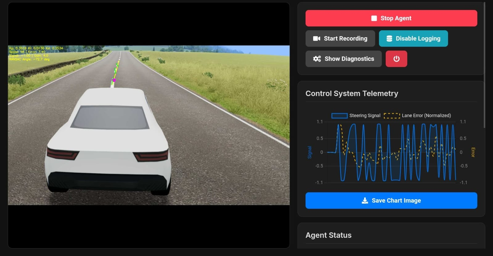
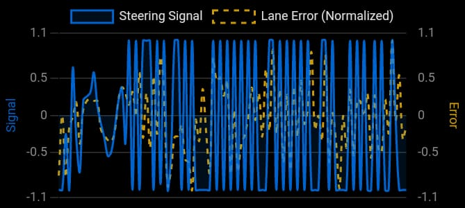
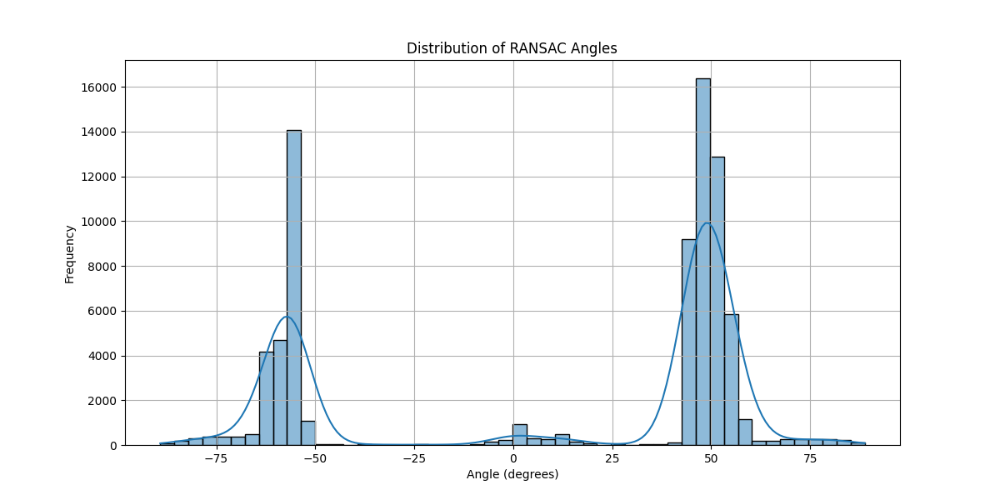
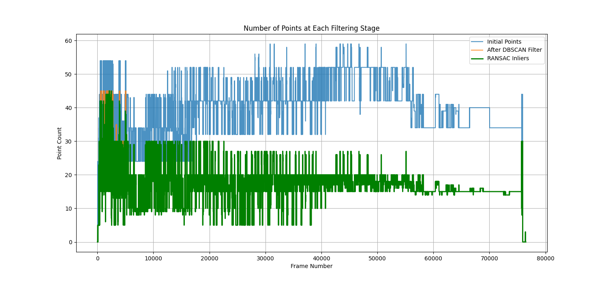

# SlowRoads Self-Driving Agent


This project is a sophisticated self-driving agent designed to play the web-based game [slowroads.io](https://slowroads.io). It uses real-time computer vision, advanced signal processing, and a PID control system to autonomously navigate the game's procedurally generated roads by following the dashed center lane.

The primary goal of this project is to learn, enhance, and showcase skills in Computer Vision (OpenCV), signal and noise processing, probabilistic methodologies like RANSAC and DBSCAN, and feedback control systems (PID).

### Live Demonstration


*The agent autonomously navigating a turn by tracking the center lane.*

---

## Core Features

-   **Real-time Lane Detection**: Captures the screen at 30 FPS and uses a robust perception pipeline involving color masking, contour analysis, **DBSCAN** clustering to reject spatial noise, and **RANSAC** regression to model the lane line with high accuracy.
-   **Advanced PID Control**: Implements a PID (Proportional-Integral-Derivative) controller with a filtered derivative term and a back-calculation anti-windup mechanism to ensure smooth, stable control and rapid recovery from error.
-   **Interactive Web Dashboard**: A Flask and Waitress-powered web UI allows for full control and monitoring of the agent from any device on the network (PC, tablet, phone).
-   **Genetic Algorithm PID Tuner**: An automated tuning system that uses a genetic algorithm to iteratively test and evolve populations of PID parameters, finding near-optimal values for stable driving.
-   **Resolution-Independent Perception**: All critical perception parameters are dynamically scaled based on the detected screen resolution, ensuring consistent performance across different monitors.
-   **PWM Steering Simulation**: Translates the continuous PID output signal into discrete keyboard presses using Pulse-Width Modulation (PWM), enabling smooth, analog-like steering in a game that only supports digital input.

---

## The Dashboard: Full Control & Telemetry

The dashboard is the central hub for interacting with the agent, providing both control and critical performance insights.

| Full Control from Any Device                               | Real-time Telemetry                                  |
| ---------------------------------------------------------- | ---------------------------------------------------- |
|  |  |
| *The UI provides toggles for all agent functions, manual PID tuning sliders, and ROI configuration.* | *A live graph plots the steering signal and lane error, giving immediate insight into the controller's performance.* |

---

## Technology Stack

-   **Language**: Python 3
-   **Computer Vision**: OpenCV, MSS (for fast screen capture)
-   **Numerical & Scientific Computing**: NumPy, SciPy, Scikit-learn, Pandas
-   **Web Backend**: Flask, Waitress
-   **User Input Simulation**: PyAutoGUI, Keyboard

---

## Installation and Setup

**Prerequisites**: Python 3.8 or newer.

1.  **Clone the repository:**
    ```bash
    git clone https://github.com/your-username/SlowRoads_SelfDriving_Agent.git
    cd SlowRoads_SelfDriving_Agent
    ```

2.  **Create and activate a virtual environment (recommended):**
    ```bash
    # For Windows
    python -m venv venv
    .\venv\Scripts\activate

    # For macOS/Linux
    python3 -m venv venv
    source venv/bin/activate
    ```

3.  **Install the required dependencies:**
    ```bash
    pip install -r requirements.txt
    ```

4.  **One-Time ROI Configuration (Important!):**
    The agent needs to know where to look on your screen. Open `src/agent.py` and adjust the `DEFAULT_GAME_BOUNDING_BOX_RATIOS` to define the primary game window on your monitor. The other ROIs are relative to this box and should work by default.

---

## How to Run

1.  **Navigate to the source directory:**
    ```bash
    cd src
    ```

2.  **Run the agent script:**
    ```bash
    python agent.py
    ```

3.  **Open the Dashboard:**
    The terminal will display URLs. Open `http://127.0.0.1:5000` in a browser on the same computer, or use the network URL on a tablet or other device.

4.  **Start Driving:**
    -   Open [slowroads.io](https://slowroads.io) in another window and position it within the defined ROI.
    -   On the dashboard, click **"Start Agent"**.
    -   For initial setup, it's recommended to use the **"Auto-Tune"** mode to let the genetic algorithm find good PID values for your system.

---

## Performance Analysis & Key Findings

The agent logs detailed perception data to `agent.log`. An analysis script is provided to parse this log and generate performance reports and visualizations. After a long-duration test run, the following results were achieved, demonstrating the agent's high level of stability and accuracy.

**To run the analysis:**
```bash
# From the src/ directory
python utils/analyze_logs.py
```

### Key Finding: 99.97% Perception Accuracy

The most significant success of this project is the incredibly low rate of perception failure. Out of **76,499** total frames processed, the agent failed to produce a valid line model in only **21** frames where a wild angle was detected with low confidence.

-   **Calculation:** `(21 error frames / 76,499 total frames) * 100 = 0.027%`
-   **Conclusion:** This translates to a **99.97% success rate** in perception, proving the robustness of the combined DBSCAN + RANSAC pipeline in handling visual noise and ambiguity. The agent's ability to maintain control with such a low error rate is a testament to the effectiveness of its design.

### Statistical Summary

The raw output from the analysis script provides a deep dive into the agent's behavior.

```
Successfully parsed 76499 perception frames from the log.

--- Core Statistics ---
              angle  initial_points  dbscan_points       inliers       target_x
count  76499.000000    76499.000000   76499.000000  76499.000000   76499.000000
mean      11.121916       39.652531      17.977045     17.702114     573.293180
std       51.504380        8.711631       5.735888      5.459018    3205.281261
min      -89.150537        0.000000       0.000000      0.000000 -175508.000000
25%      -55.975746       34.000000      15.000000     15.000000     508.000000
50%       46.053329       42.000000      18.000000     18.000000     702.000000
75%       50.243081       43.000000      20.000000     20.000000     913.000000
max       88.789566       59.000000      45.000000     45.000000    3020.000000

--- Boolean Flag Analysis ---
Persistence Check Forced: 5.44% of frames
Considered Stable (Jitter): 82.29% of frames
Final Line Validated:     83.75% of frames
```

### Automated Insights & Interpretation

-   **High Inlier Agreement (98.12%)**: The RANSAC model agrees with the DBSCAN point cluster 98.12% of the time. This indicates that the initial filtering stage is highly effective, providing a clean set of points to the regression model and preventing it from fitting to noise.
-   **Stable Angle Detection**: The median (`50%`) and 75th percentile angles are `46.05°` and `50.24°` respectively. This aligns perfectly with the typical curvature of the roads in the game, showing that the agent correctly perceives and models the most common driving scenarios.
-   **Robust Validation Logic**: The agent produced a `Final Line Validated` output in **83.75%** of frames. The remaining frames were handled gracefully by the agent's smoothing and persistence logic, preventing erratic behavior and ensuring a smooth ride.

### Analysis Visualizations

These graphs visually confirm the statistical findings, showing a well-behaved and stable system.

| Angle Distribution                               | Point Filtering Funnel                               |
| ------------------------------------------------ | ---------------------------------------------------- |
|  |  |
| *Distribution of detected lane angles, showing a strong concentration around the 40-50 degree mark, typical for gentle turns.* | *Number of points at each stage of the perception pipeline, showing the effectiveness of DBSCAN and RANSAC filtering.* |

---

## Disclaimer

This project was created for educational purposes to explore concepts in AI and computer vision. The game `slowroads.io` was not developed by me, and I hold no rights to it. This agent is designed solely for interacting with the game and is not intended for any real-world application.

## License

This project is licensed under the MIT License - see the [LICENSE](LICENSE) file for details.
